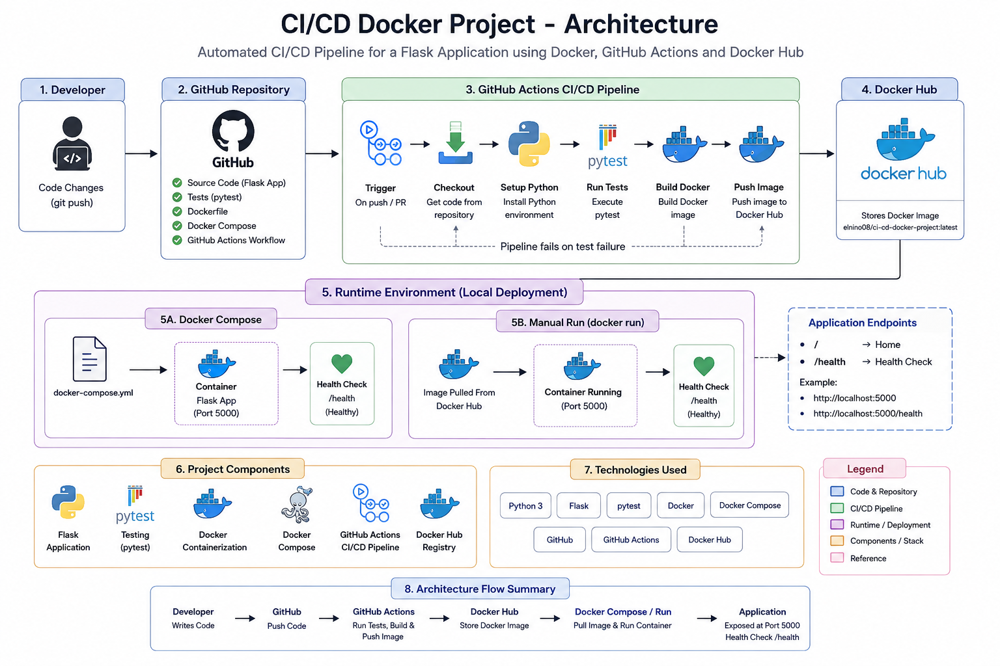

# CI/CD Docker Project

A simple Python Flask application containerized with Docker and integrated with a CI/CD pipeline using GitHub Actions.

The main purpose of this project is to understand how application code moves through a basic DevOps workflow — from development and testing to Docker image creation and publishing the image to Docker Hub.

## Architecture



## Project Overview

This project contains a small Flask application with an automated CI/CD workflow.

The workflow is triggered when code is pushed to the `main` branch or when a Pull Request is created targeting `main`.

GitHub Actions automatically:

1. Checks out the repository.
2. Sets up Python.
3. Installs the application dependencies.
4. Runs the automated tests.
5. Builds the Docker image.
6. Logs in to Docker Hub using GitHub Secrets.
7. Pushes the Docker image to Docker Hub.

The published image can then be pulled and used to run the application as a Docker container.

---

## Technologies Used

- Python
- Flask
- Pytest
- Git
- GitHub
- GitHub Actions
- Docker
- Docker Compose
- Docker Hub

---

## Project Structure

```text
ci-cd-docker-project/
│
├── app/
│   ├── __init__.py
│   ├── app.py
│   └── requirements.txt
│
├── tests/
│   └── test_app.py
│
├── scripts/
│
├── .github/
│   └── workflows/
│       └── ci.yml
│
├── .dockerignore
├── .gitignore
├── Dockerfile
├── docker-compose.yml
├── architecture.png
└── README.md

Application

The application is built using Flask.

It provides a basic application endpoint and a health-check endpoint.

Application endpoint
GET /

Example:

CI/CD Docker Project is running!
Health endpoint
GET /health

Example response:

{
  "status": "healthy"
}

The health endpoint is also used by Docker Compose to check whether the application is running correctly.

Running the Application Locally
1. Clone the repository
git clone <YOUR-GITHUB-REPOSITORY-URL>
cd ci-cd-docker-project

Replace <YOUR-GITHUB-REPOSITORY-URL> with your actual GitHub repository URL.

2. Install Python dependencies
pip install -r app/requirements.txt
3. Run the application
python app/app.py

The application will be available at:

http://localhost:5000

Health check:

http://localhost:5000/health
Running Tests

The project uses Pytest for automated testing.

Run the tests locally with:

python -m pytest

The tests verify that the application endpoints are working as expected.

The same tests are automatically executed by GitHub Actions whenever the CI pipeline runs.

Docker

The application is packaged into a Docker image so that it can run consistently across different environments.

Build the Docker image
docker build -t ci-cd-docker-project .
Run the container
docker run -d -p 5000:5000 --name ci-cd-app ci-cd-docker-project

Check running containers:

docker ps

The application will be available at:

http://localhost:5000

To stop the container:

docker stop ci-cd-app

To remove the container:

docker rm ci-cd-app
Docker Compose

The project also includes a docker-compose.yml file for running the application.

Start the application
docker compose up -d --build
Check the container
docker compose ps

The application container includes a health check that verifies the /health endpoint.

A healthy container should show:

healthy
View logs
docker compose logs

For live logs:

docker compose logs -f

Press Ctrl + C to stop viewing the logs.

This does not stop the container.

Stop the application
docker compose down
CI/CD Pipeline

The CI/CD workflow is defined in:

.github/workflows/ci.yml

The workflow runs when:

Code is pushed to main
A Pull Request targets main
Pipeline
Developer
    │
    │ git push / Pull Request
    ▼
GitHub Repository
    │
    ▼
GitHub Actions
    │
    ├── Checkout code
    │
    ├── Set up Python
    │
    ├── Install dependencies
    │
    ├── Run Pytest
    │
    ├── Login to Docker Hub
    │
    ├── Build Docker image
    │
    └── Push Docker image
            │
            ▼
       Docker Hub
This allows the project to automatically test and package the application whenever changes are made.

## Project Structure

This project was built as a hands-on way to practice DevOps and CI/CD concepts.

It demonstrates a basic workflow where application code is tested automatically, packaged into a Docker image, and published to Docker Hub through GitHub Actions.

The project also uses Docker Compose and application health checks to verify that the containerized application is running correctly.
